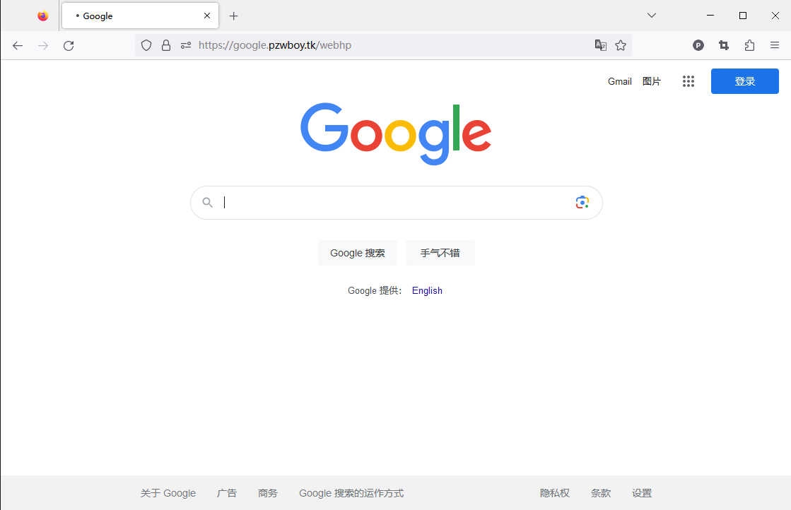

# go-proxy-webside
用 Vue3 和 Go 搭建镜像站点，可用于大部分网站

## 本项目修改于[go-proxy-bingai](https://github.com/adams549659584/go-proxy-bingai)

## 镜像展示(以谷歌为例）


## 部署

> 需 https 域名
### Vercel

一键部署，点这里 => [](https://vercel.com/new/clone?repository-url=https://github.com/pzwboy/go-proxy-webside&project-name=go-proxy-webside&repository-name=go-proxy-vercel)
### Render

一键部署，点这里 => [](https://render.com/deploy?repo=https://github.com/pzwboy/go-proxy-webside)

### Docker（从原项目复制来的，不保证100%可用）

> 参考 [Dockerfile](./docker/Dockerfile) 、[docker-compose.yml](./docker/docker-compose.yml)

- docker 示例

```bash
# 运行容器 监听8080 端口
docker run -d -p 8080:8080 --name go-proxy --restart=unless-stopped pzwboy/go-proxy-webside

# 配置 socks 环境变量
docker run -e Go_Proxy_BingAI_SOCKS_URL=192.168.0.88:1070 -e Go_Proxy_BingAI_SOCKS_USER=xxx -e Go_Proxy_BingAI_SOCKS_PWD=xxx -d -p 8080:8080 --name go-proxy-bingai --restart=unless-stopped pzwboy/go-proxy-webside
```

- docker compose 示例

```yaml
version: '3'

services:
  go-proxy-bingai:
    # 镜像名称
    image: pzwboy/go-proxy-webside
    # 容器名称
    container_name: go-proxy-bingai  
    # 自启动
    restart: unless-stopped
    ports:
      - 8080:8080
    # environment:
    #   - Go_Proxy_BingAI_SOCKS_URL=192.168.0.88:1070
    #   - Go_Proxy_BingAI_SOCKS_USER=xxx
    #   - Go_Proxy_BingAI_SOCKS_PWD=xxx
    #   - Go_Proxy_BingAI_USER_TOKEN_1=xxx
    #   - Go_Proxy_BingAI_USER_TOKEN_2=xxx    
```
## 设置镜像网站

修改项目的`common/proxy.go`

将

```
	BING_URL, _        = url.Parse("")`
```

的`("")`中添加需要被制作镜像的网站域名即可